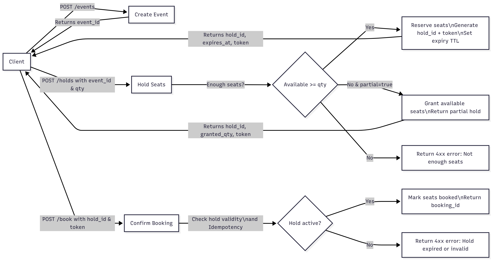

# 🎟️ Jangam Sravan's Box Office

A minimal FastAPI-based ticket booking system that supports:
- Event creation with total seats
- Temporary seat holds with TTL
- Booking confirmation with idempotency
- Partial fulfillment policy
- Metrics on events, holds, bookings, and expiries (optional bonus)


---

## 📦 Key Modules

### 1. **API Endpoints**
- `POST /events` → Create an event (`name`, `total_seats`)
- `POST /holds` → Request temporary seat hold (`event_id`, `qty`, `ttl`)
- `POST /book` → Confirm booking with an active hold (`hold_id`, `payment_token`)
- `GET /events/{id}` → Get snapshot of event state (`total`, `available`, `held`, `booked`)
- `GET /metrics` → Monitoring endpoint: totals, active holds, bookings, expiries

### 2. **Concurrency Control**
- Uses **`asyncio.Lock`** (for async FastAPI) to prevent oversubscription when multiple concurrent hold/booking requests occur.
- Critical sections:
  - ticket availability check
  - Hold creation
  - Booking confirmation

### 3. **Background Worker**
- A **background task** runs every few seconds to:
  - Scan active holds
  - Expire holds past their `expires_at`
  - Return seats back to `available`

### 4. **Idempotency**
- Each booking request requires `{hold_id, payment_token}`.
- Bookings are idempotent:
  - If retried with same `hold_id` and `payment_token`, it returns the same `booking_id`.
  - Prevents double-booking due to network retries.

---


## 🗄️ Data Model

In-memory Python dicts (can be swapped with DB later):

```python
events = {
  event_id: {
    "name": str,
    "total_seats": int,
    "available": int,
    "held": int,
    "booked": int,
    "created_at": datetime
  }
}

holds = {
  hold_id: {
    "event_id": str,
    "qty": int,
    "expires_at": datetime,
    "payment_token": str,
    "status": "active" | "expired" | "booked"
  }
}

bookings = {
  booking_id: {
    "event_id": str,
    "hold_id": str,
    "qty": int,
    "created_at": datetime
  }
}

```

---

## ⚖️ Trade-offs

- Currently using a **single `asyncio.Lock`** to handle concurrent seat-hold updates.  
- Python threads are "safe" because of the **Global Interpreter Lock (GIL)**, which ensures only one thread executes Python bytecode at a time.  
- This approach **guarantees correctness** (no race conditions in seat availability updates).  
- However, only one worker can read/write hold data at a time.  
- ✅ Pros: Simpler design, correctness guaranteed.  
- ❌ Cons: Can block the system under **high load (e.g., thousands of requests)**, leading to **delays and possible request timeouts**.  
- A more scalable approach could involve:  
  - **Per-event locks** (lock only specific events instead of all events).  
  - **Sharded locking strategy** to distribute load.  
  - **Distributed locks** (e.g., Redis Redlock) for scaling across multiple instances.  
  - **Database row-level locking** for fine-grained concurrency.  

---

## 🚀 How to Run

Note: Docker need to be installed.

### 1. Clone the Repository
```bash
git clone https://github.com/SravanJangamDev/jangam_sravan_box_office.git
cd jangam_sravan_box_office
```
### 2. Build & Launch with Docker
```
chmod +x launch.sh
./launch.sh

Application runs at port 8000
```
---

## 🚀 Sample Use

** Postman collectio **: (./box-office.postman_collection.json)

### Create event
```
- curl -X POST http://localhost:8000/events \
  -H "Content-Type: application/json" \
  -d '{"name": "Concert", "total_seats": 100}'
```

### Hold seats
```
- curl -X POST http://localhost:8000/holds \
  -H "Content-Type: application/json" \
  -d '{"event_id": "1", "qty": 5}'
```

### Confirm booking
```
- curl -X POST http://localhost:8000/book \
  -H "Content-Type: application/json" \
  -d '{"hold_id": "abc123", "payment_token": "xyz789"}'
```


